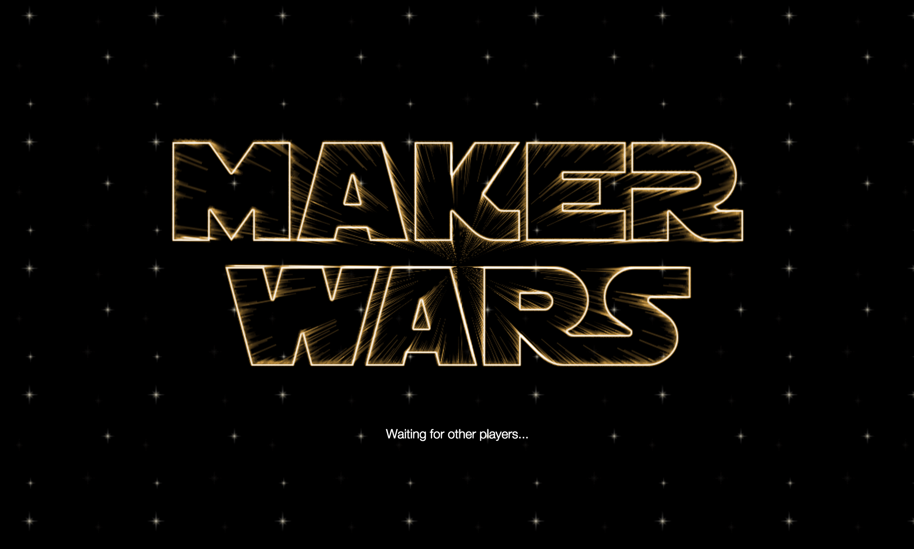
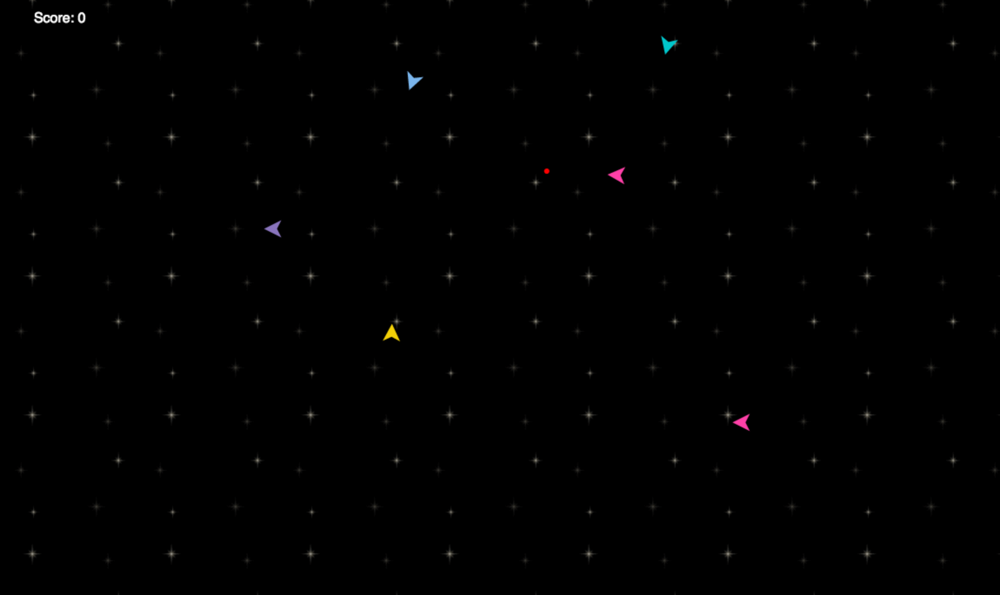

# Maker Wars

## Summary

In Week 9 at Makers Academy we were assigned to groups of four and tasked to develop a mini web project within three days, which we presented to the rest of the Academy at the end of the week. Whilst it was not something we had ever done before, we were keen to try creating a real time animated game.

Together we decided that we wanted to make a multiplayer game that could handle a large number of players, to enable audience participation during our presentation. We settled on an "Asteroids" style shoot 'em up game and set about learning how to achieve this.

In terms of technology, we decided at an early stage to use a Node.js server, with web sockets for enabling real time communication between clients. We investigated the possibility of using the Phaser game engine framework, but ultimately decided to use HTML5 canvas to render the ships and missiles. Combined with Node.js and web sockets, this allowed us to achieve fast game performance.

## Technologies Used

- Node.js
- Express.js
- Socket.io
- Javascript
- JQuery
- HTML5 canvas
- Jasmine
- Mocha/Chai/CasperJS
- JSHint
- Grunt
- Heroku

## Collaborators

- [Ed Byne](https://github.com/ejbyne)
- [Ming Chan](https://github.com/ming-chan)
- [Claudia Beresford](https://github.com/Callisto13)
- [Attila Mirk](https://github.com/Tr1ckX)

## Screenshots

### Title screen

### Game screen

## Instructions

The live version of the game is available at <a href="https://maker-wars.herokuapp.com">https://maker-wars.herokuapp.com</a>. The game will automatically start once at least two players have joined.

Use the keyboard arrows for moving around the screen, and the space bar to fire.

To try the game locally, please clone this repository on your machine:

~~~
$ git clone https://github.com/ejbyne/spaceships-project.git
~~~

Change into the directory and npm install the modules:

~~~
$ cd spaceships-project
$ npm install
~~~

Start the node server:

~~~
$ npm start
~~~

Visit <a href="http://localhost:3000">http://localhost:3000</a>.

Run the tests:

~~~
$ npm test
~~~

## To do List

- Add ability to input player names.
- Add leaderboard for highest scorers.
- Game logic is currently all on the client side. Consider moving game logic server side subject to this not slowing game performance.
- Fix minor bugs, in particular an issue that it's sometimes possible to crash into a ship that has already been destroyed.
- Learn to test web sockets and apply to our project.

## Reflections

This was a challenging project given our lack of experience in developing games. We were required to master how to render animated objects using HTML5 canvas and integrating this with web sockets so that coordinates and other necessary information could be passed between clients at the right times. HTML5 canvas also required quite complex geometrical calculations which were certainly a test for our maths skills!

We all learned a great deal from project, not least working together as a team and our teamwork/efficiency certainly improved a lot as each day passed. Although the game itself is fairly simple, the technology behind it is incredibly powerful and I have learned skills that would enable me to move on to creating far more sophisicated software.
